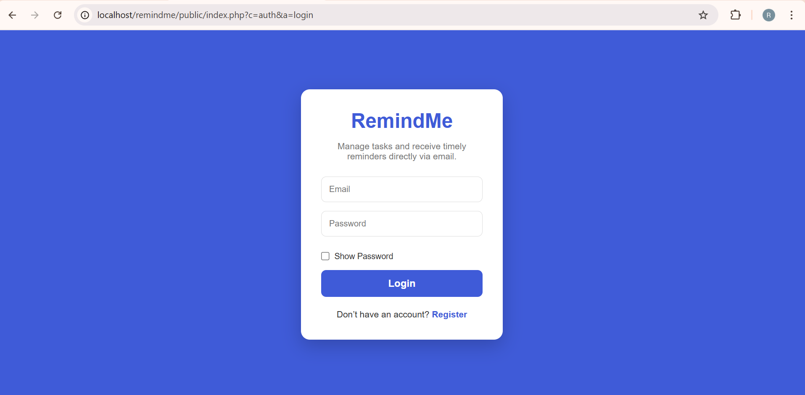
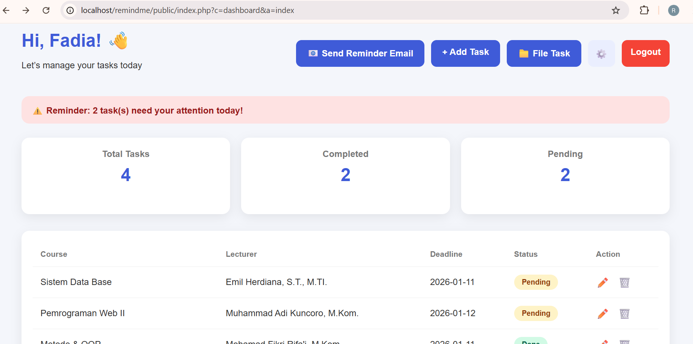
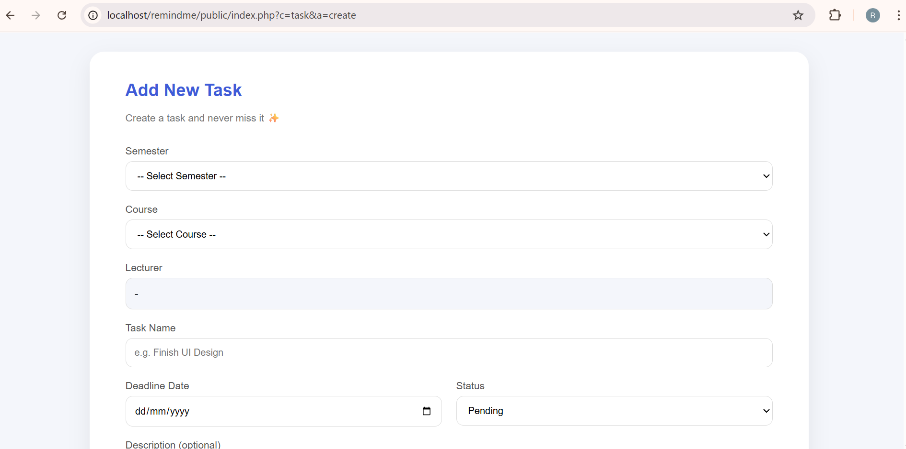
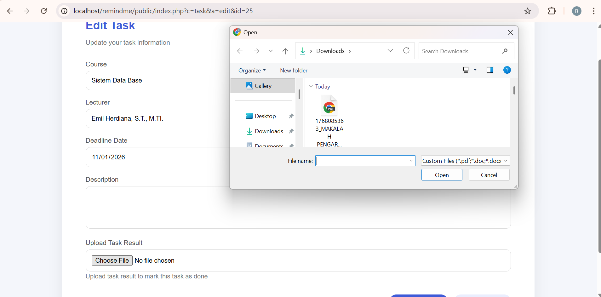

# RemindMe 📌

**RemindMe** is a web-based task and assignment reminder application designed to help students organize academic tasks, track deadlines, and manage assignment files efficiently.

> **Never Miss Your Tasks.**

## ✨ Features

* 🔐 **Authentication** — User registration and login
* 📊 **Dashboard Statistics** — Track total, completed, and pending tasks
* ⏰ **Deadline Reminders** — Receive alerts for upcoming deadlines
* 📩 **Email Notifications** — Send reminder emails for upcoming tasks
* 📝 **Task Management** — Create, edit, update, and delete tasks
* 📁 **Assignment File Management** — Upload and download assignment files
* 📚 **Course & Lecturer Tracking** — Organize tasks by course and lecturer

## 🛠️ Tech Stack

| Technology | Purpose                     |
| ---------- | --------------------------- |
| PHP Native | Backend & application logic |
| MySQL      | Database management         |
| HTML       | Page structure              |
| CSS        | Interface styling           |
| JavaScript | Client-side functionality   |
| XAMPP      | Local development server    |
| phpMyAdmin | Database administration     |

## 📸 Preview

### Login



### Dashboard



### Add Task



### Edit Task



### Completed Task


## 🚀 Installation

### 1. Clone the repository

```bash
git clone https://github.com/rskaervy/remindme.git
```

### 2. Move the project

Move the project folder into the XAMPP `htdocs` directory:

```text
C:\xampp\htdocs\remindme
```

### 3. Create the database

Open **phpMyAdmin** and:

1. Create a database named `reminder_app`
2. Import the provided `reminders_app.sql` file

### 4. Run the application

Start **Apache** and **MySQL** from XAMPP, then open:

```text
http://localhost/remindme/public
```

## 📂 Project Structure

```text
remindme/
├── app/
├── public/
├── assets/
├── reminders_app.sql
└── README.md
```

> The project structure may vary depending on the current version of the application.

## 🎯 Project Purpose

RemindMe was developed as a student-focused task management application to provide a simple way to organize assignments, monitor deadlines, and manage related academic files in one place.

The project demonstrates practical experience with **PHP web development, database integration, CRUD operations, authentication, file handling, and notification functionality**.

## 👩‍💻 Author

**Riska Erviany**

Information Management Student
Universitas Putra Indonesia (UNPI)
